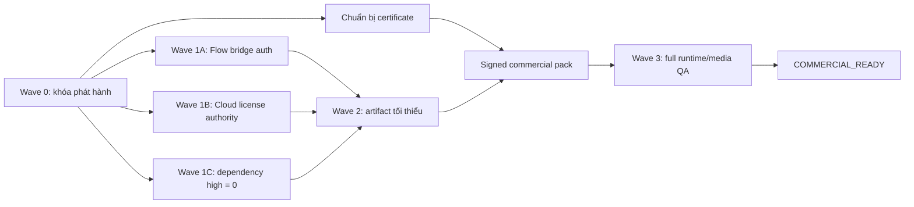

# KẾ HOẠCH TRIỂN KHAI SECURITY HARDENING

**Nguồn:** [`SECURITY_PREPACK_AUDIT.md`](SECURITY_PREPACK_AUDIT.md)  
**Mục tiêu:** đóng trạng thái `SECURITY_BLOCKED` bằng các thay đổi có thể kiểm thử, không làm thay đổi nghiệp vụ viết truyện, media, TTS, Flow và CapCut.

## 1. Quy tắc triển khai

1. `dist-qa-unsigned` chỉ dùng QA nội bộ; tắt updater và không publish feed.
2. Mỗi ticket phải có commit riêng, test riêng và bằng chứng terminal.
3. Không trộn nâng dependency, sửa Flow và thu gọn artifact trong cùng một commit.
4. Không dùng obfuscation/anti-debug để thay cho authentication, chữ ký hoặc server authority.
5. Không gọi ticket hoàn thành nếu chỉ typecheck; phải đạt acceptance test của ticket.
6. Sau mỗi wave phải chạy regression media thật trước khi sang wave kế tiếp.



## 2. Wave 0 — Khóa phát hành hiện tại

### SEC-000 — Phân biệt QA và commercial

**Thay đổi**

- QA unsigned: `AINOVEL_UPDATE_CHECK_ON_LAUNCH=0`, không upload `latest.yml`.
- Commercial: chỉ dùng `pack:commercial`, không dùng `pack:ship`.
- Tạo nhánh triển khai riêng; không sửa trực tiếp artifact đã build.

**File**

- `resources/commercial/public.env`
- `package.json`
- `scripts/preflight-pack.mjs`

**Acceptance**

- QA app không tự check/download/install update.
- `preflight:pack` không còn in “safe to pack” khi security stop-gate đang FAIL.
- Script publish từ chối mọi path dưới `dist-qa-unsigned`.

---

## 3. Wave 1 — Đóng toàn bộ P0

### SEC-101 — Xác thực Flow bridge theo từng lần chạy

**Rủi ro đang đóng**

- Socket giả nhận `callbackSecret` và Flow bearer.
- HTTP callback/proxy không có authentication bắt buộc.
- Website hoặc local process có thể gọi bridge khi đang chạy.

**File sửa**

- `src/lib/flow-bridge/bridgeServer.ts`
- `src/lib/flow-bridge/chromeSession.ts`
- `src/lib/flow-bridge/remoteBridge.ts`
- `src/lib/flow-bridge/bootstrap.ts`
- `extensions/ainovel-flow/background.js`
- `extensions/ainovel-flow/manifest.json`

**File mới đề xuất**

- `src/lib/flow-bridge/bridgeSecurity.ts`
- `scripts/smoke-flow-bridge-auth.mts`

**Thiết kế bắt buộc**

1. `bridgeSecurity.ts` sinh token 32 byte bằng `crypto.randomBytes(32)` khi bridge khởi động.
2. Mỗi account có token riêng; server chỉ giữ hash/token trong memory và xóa khi bridge dừng.
3. `ensureAccountExtension()` đã tạo bản copy extension riêng theo account. Mở rộng `ACCOUNT_BIND.json`:

   ```json
   {
     "accountId": "account-id",
     "wsUrl": "ws://127.0.0.1:<random-port>",
     "httpUrl": "http://127.0.0.1:<random-port>",
     "sessionToken": "<random-per-launch-token>"
   }
   ```

4. Extension đọc file bằng `fetch(chrome.runtime.getURL('ACCOUNT_BIND.json'))`; không lưu token lâu dài vào `chrome.storage`.
5. WS gửi token trong subprotocol hoặc message `auth` đầu tiên. Server chưa xác thực thì:
   - không thêm socket vào `s.sockets`;
   - không nhận `accountId` làm danh tính;
   - không gửi `callback_secret`;
   - không gửi `inject_flow_key`.
6. Pin extension ID bằng public `key` trong manifest và kiểm tra đúng `Origin: chrome-extension://<id>`.
7. Mọi HTTP route ngoài health yêu cầu:
   - `Authorization: Bearer <sessionToken>`;
   - account ID đã bind với token;
   - so sánh token bằng `crypto.timingSafeEqual`.
8. Health không auth chỉ được trả `{ ok, version }`; không trả account, token, queue hoặc path.
9. Bỏ `Access-Control-Allow-Origin: *`. Chỉ trả origin extension đã pin; request không có origin chỉ được chấp nhận khi bearer hợp lệ.
10. Không ghi token, bearer hoặc full authorization header vào log.

**Acceptance test**

- WS không token → đóng `4401`.
- WS sai extension origin → đóng `4403`.
- WS account A dùng token B → từ chối.
- HTTP thiếu/sai token → `401/403`.
- Socket chưa auth gửi `extension_ready` → không nhận Flow bearer.
- Extension thật đăng nhập Flow, bridge nhận token và gen một ảnh thật thành công.
- Restart app làm token cũ hết hiệu lực.

### SEC-102 — Khóa proxy và file sink của Flow

**File sửa**

- `src/lib/flow-bridge/accountProxy.ts`
- `src/lib/flow-bridge/bridgeServer.ts`
- `extensions/ainovel-flow/background.js`

**Thiết kế bắt buộc**

1. `proxy-as-account` chỉ cho HTTPS và các host:
   - `labs.google`;
   - `aisandbox-pa.googleapis.com`;
   - `aisandbox-pa.sandbox.googleapis.com`;
   - các Google storage host thật sự cần cho download.
2. Allowlist method/path theo từng thao tác; mặc định deny.
3. Dùng redirect manual; redirect sang host ngoài allowlist phải fail.
4. Loại header do caller tự chèn: `Host`, `Cookie`, `Authorization`, `Proxy-*`, `Forwarded`, `X-Forwarded-*`.
5. Thay `x-dest-path` bằng `sinkId` ngẫu nhiên một lần:
   - app tạo map `sinkId -> absolute destination`;
   - destination phải nằm dưới output root;
   - sink có TTL và dùng một lần;
   - extension không được quyết định đường dẫn đĩa.
6. Stream file xuống temp file, giới hạn byte, kiểm tra content type/magic bytes rồi atomic rename. Không `Buffer.concat()` toàn bộ video vào RAM.

**Acceptance test**

- URL `http://`, metadata IP, localhost và host ngoài Google → từ chối.
- Redirect sang host ngoài allowlist → từ chối.
- `..\`, UNC, junction/symlink escape và absolute path từ extension → từ chối.
- Sink thiếu/hết hạn/dùng lại → từ chối.
- Download ảnh/video thật của Flow vẫn lưu đúng output root.

### SEC-103 — Ledger, revoke và device proof cho Cloud IP

**Rủi ro đang đóng**

- Trial nhận HWID tự khai.
- Crown route chỉ kiểm chữ ký token; token revoked hoặc token sao chép có thể được replay.

**File sửa**

- `src/app/api/cloud/license/trial/route.ts`
- `src/lib/commercial/ip/cloudIpAuth.ts`
- toàn bộ `src/app/api/cloud/ip/*/route.ts`
- `src/lib/commercial/ip/*CloudBridge.ts`
- `src/lib/cloud/licenseBridge.ts`
- `main.js`

**File mới đề xuất**

- `electron/deviceIdentity.js`
- `src/lib/commercial/deviceProof.ts`
- `supabase/migrations/<timestamp>_license_device_proof.sql`
- `scripts/smoke-cloud-license-replay.mts`

**Thiết kế bắt buộc**

1. Electron main tạo Ed25519 device keypair lần đầu.
2. Private key được mã hóa bằng `safeStorage`/DPAPI và không trả cho renderer. Server chỉ nhận chữ ký.
3. Ledger lưu `device_key_id` và public key của thiết bị đã bind.
4. Mỗi Crown request có:
   - `x-ainovel-device-id`;
   - `x-ainovel-timestamp`;
   - `x-ainovel-nonce`;
   - `x-ainovel-body-sha256`;
   - `x-ainovel-device-signature`.
5. Chữ ký bao phủ method, pathname, timestamp, nonce và body hash.
6. Server từ chối timestamp ngoài cửa sổ 60 giây và nonce đã dùng.
7. `assertCloudIpToken()` đổi thành async authorization và phải:
   - verify chữ ký/expiry token;
   - hash token;
   - tìm đúng ledger row;
   - yêu cầu `status=active`;
   - kiểm tra ledger expiry;
   - so khớp token hash, claim HWID, ledger HWID và device key;
   - verify device signature;
   - kiểm tra tier/feature.
8. Tất cả Crown routes phải `await` chung một hàm authorization; không tự verify rải rác.
9. Trial:
   - không còn auth tùy chọn;
   - yêu cầu user identity hoặc quy trình enrollment được duyệt;
   - một trial trên user + device key + HWID;
   - rate limit và audit log;
   - không fallback local trial trong packaged customer.

**Acceptance test**

- Token hợp lệ + active ledger + đúng device signature → PASS.
- Xóa/revoke ledger row → request tiếp theo `403`.
- Token máy A + HWID máy A nhưng ký bằng key máy B → `403`.
- Token hợp lệ nhưng thiếu HWID/signature → `403`.
- Replay cùng nonce → request thứ hai `403`.
- Sửa một byte trong body sau khi ký → `403`.
- Hết hạn ledger hoặc token → `403`.
- Paid Pro thật vẫn mở đúng Crown route; Free vẫn bị chặn.

### SEC-104 — Xóa dependency production mức high

**File sửa**

- `package.json`
- `package-lock.json`

**Cách triển khai**

1. Nâng Next.js tối thiểu lên bản vá mà `npm audit` hiện đề xuất, bắt đầu với:

   ```powershell
   npm install next@16.2.12 --save-exact
   ```

2. Không chạy `npm audit fix --force` rồi nhận toàn bộ thay đổi mù. Chạy `npm audit fix` không force, xem diff lockfile.
3. `sharp` phải lên `>=0.35.0` qua Next/bản dependency tương thích.
4. Theo dõi `brace-expansion` bằng:

   ```powershell
   npm ls --omit=dev brace-expansion --all
   ```

   Đường hiện tại đi qua `puppeteer-extra-plugin-user-data-dir -> rimraf -> glob -> minimatch`. Nâng dependency cha hoặc thêm override tương thích sau khi test Flow; không chỉ xóa advisory khỏi lockfile.

**Acceptance test**

```powershell
npm audit --omit=dev --audit-level=high
npm run typecheck
npm run test:e2e
npx.cmd tsx scripts/smoke-flow-runtime-e2e.mts
npx.cmd tsx scripts/verify-tts-no-fallback.ts
```

Production high/critical phải bằng 0. Sau nâng Next phải smoke Electron boot, local API, image optimization, server actions và Flow browser.

### SEC-105 — Ký app và khóa updater

**Việc ngoài code cần làm song song**

- Mua/chuẩn bị Authenticode certificate và timestamp service.
- Cấu hình CI/release secret:
  - `CSC_LINK`;
  - `WIN_CSC_PUBLISHER_NAME`;
  - `WIN_CSC_CERTIFICATE_SHA1`.

**File sửa**

- `package.json`
- `electron/updater.js`
- `resources/commercial/public.env`
- `scripts/assert-commercial-signing.mjs`
- `scripts/assert-commercial-package.mjs`

**Thiết kế bắt buộc**

1. `pack:commercial` ép `forceCodeSigning=true`.
2. Commercial profile ép `AINOVEL_UPDATE_ALLOW_UNSIGNED=0`.
3. QA profile ép `AINOVEL_UPDATE_CHECK_ON_LAUNCH=0`.
4. Không dùng cùng một `public.env` cho QA unsigned và commercial. Tạo staging env theo build profile.
5. Sau pack, kiểm tra chữ ký của:
   - app executable;
   - NSIS installer;
   - `XinChao-Cut.exe`;
   - các helper executable do app spawn.
6. Kiểm tra `Status=Valid`, đúng publisher và có timestamp.
7. `pack:commercial` phải chạy `assert:commercial-package` sau `audit:package`.
8. Updater chỉ spawn installer sau khi hash, Authenticode publisher và version đều đúng.

**Acceptance test**

```powershell
Get-AuthenticodeSignature "<app.exe>"
Get-AuthenticodeSignature "<installer.exe>"
Get-AuthenticodeSignature "<XinChao-Cut.exe>"
```

- Một trong các file `NotSigned`, `HashMismatch`, sai publisher hoặc thiếu timestamp → build/publish FAIL.
- QA unsigned không check update.
- Commercial signed update từ feed thật → download, verify, cài lần mở sau và khởi động đúng version.

---

## 4. Wave 2 — Đóng P1 và giảm bề mặt dịch ngược

### SEC-201 — Tạo XinChao runtime tối thiểu

**Vấn đề hiện tại**

- `electron/xinchaoRuntimeHost.cjs` coi `App.tsx`, `lib.rs`, `backend/app/main.py` là marker bắt buộc.
- `package.json` copy toàn bộ `tools/xinchao-cut/**/*`.
- `audit-packaged-artifact.cjs` cũng bắt source phải tồn tại.

**Thay đổi**

1. Đổi `SOURCE_MARKERS` thành runtime markers:
   - `LICENSE`;
   - `dist/index.html`;
   - `runtime-manifest.json`;
   - executable/backend bundle thật sự cần.
2. `runnable` không được phụ thuộc `src`, `src-tauri` hoặc `backend/app/main.py`.
3. Tạo staging directory riêng, ví dụ `build-runtime/xinchao-cut`, chỉ chứa allowlist.
4. Frontend chỉ ship `dist`.
5. Backend Python dùng runtime đã compile/bundle được kiểm thử; không ship source tree, test, scripts setup và `.work`.
6. `extraResources` copy staging directory, không copy repo `tools/xinchao-cut`.

**Acceptance**

- XinChao mở độc lập từ app và dùng media thật trên đĩa.
- Không có `.ts`, `.tsx`, `src-tauri`, test hoặc `backend/app/*.py` trong artifact.
- TTS/ảnh/video vẫn khớp timeline JSON thật.

### SEC-202 — Thu gọn Python, extension và extraResources

**File sửa**

- `package.json`
- build/staging scripts liên quan
- `scripts/audit-packaged-artifact.cjs`

**Thay đổi**

- Bỏ duplicate `src/python_core/**/*`.
- Chỉ ship một Python runtime tree đã allowlist/compile.
- Extension chỉ ship file runtime cần thiết; bỏ metadata/dev file.
- Không ship `PACKAGING_STANDARD.md` nếu runtime không sử dụng.
- Không ship `.work`, database, logs, account profile, generated media hoặc config máy build.
- Tạo manifest SHA-256 ký số cho mọi `extraResources`.
- Main xác minh manifest trước khi spawn child runtime.

**Acceptance**

- Đổi một byte trong child EXE/script/runtime asset → app từ chối chạy thành phần đó và ghi audit event.
- Artifact scan toàn cây trả 0 source ngoài allowlist.

### SEC-203 — Bytenode và fuses fail-closed

**File sửa**

- `scripts/build-bytenode-main.cjs`
- `package.json`
- `scripts/electron-fuses.cjs`
- `scripts/audit-packaged-artifact.cjs`

**Thay đổi**

1. `build-bytenode-main.cjs` phải throw/exit non-zero khi file thiếu hoặc compile lỗi.
2. Compile bằng đúng Electron/V8 version đang đóng gói.
3. Commercial artifact dùng loader + `main.jsc`, exclude plaintext `main.js`.
4. QA/dev vẫn dùng `main.js`; không thay đổi dev workflow.
5. Audit đọc packaged `package.json`, xác nhận `main` tồn tại và không fallback plaintext trên commercial.
6. Pin `@electron/fuses` trực tiếp.
7. Xóa mọi fallback tự tắt ASAR integrity hoặc bỏ `OnlyLoadAppFromAsar` trong commercial build.
8. Post-pack đọc fuse thật; sai một fuse bắt buộc → fail.

**Acceptance**

- Artifact commercial có entrypoint thật, boot được và không có plaintext `main.js`.
- Xóa/đổi `main.jsc` → app không boot.
- Fuses đúng policy; hook lỗi → pack FAIL, không “partial OK”.

> Bytenode chỉ tăng chi phí phân tích. Logic giá trị cao vẫn phải ở cloud authority.

### SEC-204 — Nâng artifact audit thành release gate thật

**File sửa**

- `scripts/audit-packaged-artifact.cjs`
- `scripts/smoke-unpacked-desktop.ps1`
- `scripts/assert-commercial-package.mjs`

**Thay đổi**

1. Sửa boot smoke dùng `productName` từ packaged `package.json`, không hardcode `AI Novel & Script Generator.exe`.
2. Audit cả ASAR và `extraResources`.
3. Không bắt source XinChao/Python tồn tại.
4. Fail khi:
   - có source/runtime file ngoài allowlist;
   - `shellHardened=false`;
   - package main thiếu;
   - child executable sai hash/chữ ký;
   - secret/private marker;
   - fuse sai;
   - QA updater bật;
   - commercial updater unsigned.
5. Tách kết quả `QA_ARTIFACT_OK` và `COMMERCIAL_ARTIFACT_OK`; không dùng một PASS chung.

**Acceptance**

- Artifact hiện tại phải bị gate mới đánh FAIL.
- Artifact đã harden phải PASS audit rồi PASS boot smoke trên chính EXE vừa tạo.

### SEC-205 — Thu secret khỏi renderer

**File sửa**

- `main.js`
- `preload.js`
- `electron/credentialVault.js`
- `electron/workBridge.js`
- `electron/workHost.cjs`
- provider clients đang đọc credential trực tiếp

**Thay đổi**

- Bỏ IPC trả toàn bộ plaintext credential.
- Renderer chỉ giữ opaque credential handle/trạng thái “đã cấu hình”.
- Main/utility process gắn secret vào request theo provider allowlist.
- `ainovelWork.fetch` giới hạn URL/method/header/body.
- IPC nhạy cảm kiểm tra main frame + exact origin.

**Acceptance**

- DevTools/renderer không đọc được raw API key qua preload.
- Provider thật vẫn gọi thành công.
- URL ngoài allowlist và header `Authorization` do renderer tự chèn bị chặn.

---

## 5. Wave 3 — P2 hardening

Triển khai sau khi Wave 1 và Wave 2 đã ổn định:

1. Per-launch auth cho local Next API; mutating route kiểm tra Origin/Sec-Fetch.
2. Random local port; packaged mode cấm adopt server ngoài process của app.
3. CSP production dùng nonce, bỏ `unsafe-inline`, giới hạn provider origins.
4. Server-signed offline lease + rollback-clock detection.
5. SPKI production pins và quy trình rotation overlap.
6. Navigation/window-open/permission guard cho XinChao window.
7. SBOM, provenance và secret scan trên staging cuối.
8. Security telemetry không chứa secret.

Không ưu tiên anti-debug/RAM watchdog trước các hạng mục trên. Chúng dễ gây false positive và không thay thế server authority hoặc chữ ký artifact.

## 6. Thứ tự commit khuyến nghị

| Commit | Phạm vi |
|---|---|
| 1 | `SEC-000` khóa QA updater/publish |
| 2 | `SEC-101` Flow authentication |
| 3 | `SEC-102` Flow proxy + sink confinement |
| 4 | `SEC-103` cloud ledger + device proof |
| 5 | `SEC-104` dependency remediation |
| 6 | `SEC-105` signing profiles/updater |
| 7 | `SEC-201` XinChao runtime staging |
| 8 | `SEC-202` extraResources manifest/minimize |
| 9 | `SEC-203` Bytenode/fuses fail-closed |
| 10 | `SEC-204` artifact/boot gate |
| 11 | `SEC-205` credential boundary |
| 12 | Wave 3 hardening |

Không squash trước khi full regression PASS; giữ commit nhỏ để bisect lỗi media/runtime.

## 7. Gate cuối để đổi sang `COMMERCIAL_READY`

```powershell
npm audit --omit=dev --audit-level=high
npm run typecheck
npm run test:e2e
npm run smoke:commercial
npm run smoke:anti-tamper
npm run preflight:pack:signed
npm run pack:commercial
npm run audit:package -- dist/win-unpacked
npm run smoke:unpacked-desktop
npm run test:desktop-release
```

Ngoài các lệnh trên phải có:

- Flow auth/adversarial tests PASS.
- Cloud replay/revoke/device-proof tests PASS.
- Authenticode của app/installer/child EXE là `Valid`.
- Một workflow thật: TTS toàn chương → timestamp JSON → ảnh/video thật → timeline XinChao/CapCut khớp → export phát được tiếng.
- Audit độc lập xác nhận không còn P0/P1 chưa có owner hoặc exception.

Nếu một gate FAIL, trạng thái vẫn là `SECURITY_BLOCKED`; không publish feed và không giao installer cho khách.
