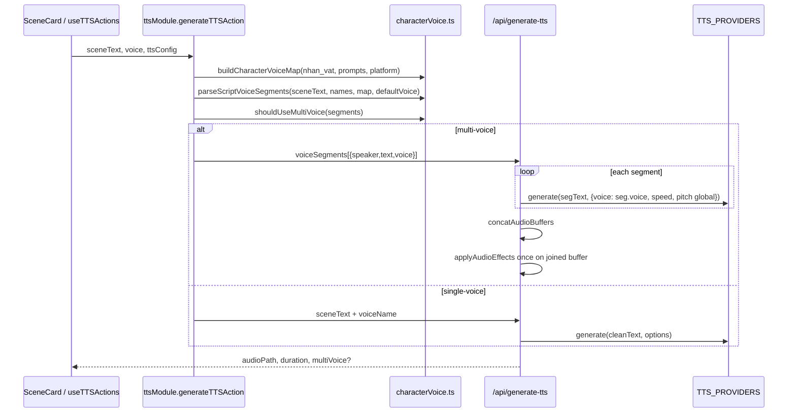
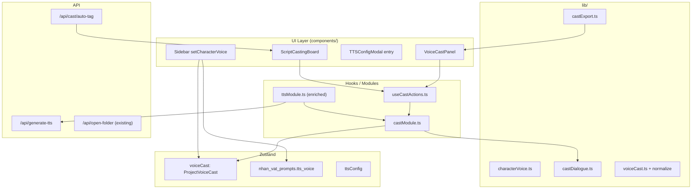
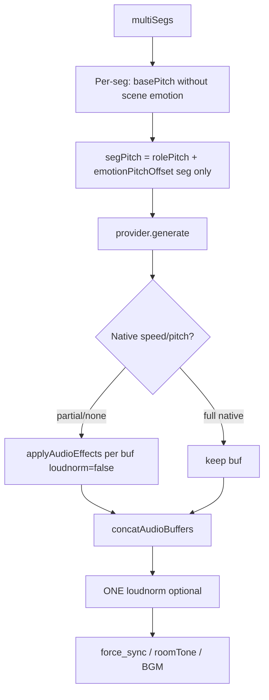

# Design Doc: Multi-Character Role Casting Studio (AI Novel)

| Field | Value |
|-------|--------|
| **Title** | Role Casting / Multi-Character Voice Studio for AI Novel |
| **Author** | _(TBD)_ |
| **Date** | 2026-07-10 |
| **Status** | Draft (Rev 3 — residual re-review closed) |
| **Product** | AI Novel (`d:\My app\AI Novel`) |
| **Reference** | Vina-Voice V5.4 (`D:\Vina-Voice_V5.4\Vina-Voice_V5.4`) — closed-source; reverse-engineered from JSON/INI/help |
| **Related stack** | Next.js App Router, TypeScript, Tailwind v4, Zustand persist, existing TTS multi-voice path |

---

## Overview

AI Novel đã có đường ống **đa giọng theo lượt thoại** (multi-voice TTS): mỗi nhân vật có thể gán `tts_voice` trong `NhanVatProfile`, kịch bản dạng `Tên NV: ...` được `parseScriptVoiceSegments` tách thành segment, rồi `/api/generate-tts` sinh từng đoạn và nối buffer. Tuy nhiên UX còn mỏng (một dropdown trong Sidebar), thiếu override speed/pitch/emotion theo vai, thiếu bảng gán vai theo dòng, thiếu auto-tag AI cho văn xuôi có thoại trích dẫn, và thiếu narrator như first-class role — các năng lực cốt lõi mà Vina-Voice Role Tab + Auto Role + SRT role column cung cấp.

Tài liệu này đề xuất **Role Casting Studio** native trong AI Novel: nâng cấp đường ống multi-voice hiện có thành studio phân vai đầy đủ (Voice Cast Panel + Script Casting Board), lưu cast ở cấp project trong Zustand, sinh TTS với speed/pitch/emotion per-role, và (tùy chọn) export/import JSON tương thích Vina-Voice `roles.json` / `Role-Profile/*.json` cho user có engine clone offline.

**Nguyên tắc thiết kế:** không redesign TTS từ đầu; không phá single-voice path; modular, không rối video/image pipelines; hydration-safe; thẩm mỹ cyberpunk glass theo `Agents.md`.

**Rev 2 notes:** Prosody algorithm, dual-write SoT, content-hash IDs, Vina fixtures, AI budget, PR/Rollout sync, platform migration, self-heal, preview, contracts.

**Rev 3 notes:** `shouldUseCastMulti` ignores storyboard emotion (Case A table); PR4 hard-deps PR1a+PR2+PR3; sticky `vinaRoleIndex` seed/export rules; VieNeu `resolveNativeFlags` + provider fix to prevent double-atempo.

---

## Background & Motivation

### Current state (AI Novel) — đã có

| Thành phần | Đường dẫn | Vai trò |
|------------|-----------|---------|
| `NhanVatProfile.tts_voice` | `src/lib/characterProfile.ts` | Voice ID gắn NV |
| `getCharacterVoiceOptions`, `suggestVoiceFromProfile`, `parseScriptVoiceSegments`, `shouldUseMultiVoice`, `buildCharacterVoiceMap` | `src/lib/characterVoice.ts` | Gợi ý voice + parse `Name:` lines |
| Multi-voice build + POST | `src/app/workspace/modules/ttsModule.ts` (`generateTTSAction` ~248–306) | Build `charVoiceMap` + `voiceSegments` |
| Multi-segment generate + concat | `src/app/api/generate-tts/route.ts` (~690–950) | `useMulti` → per-seg `provider.generate` → `concatAudioBuffers` |
| UI gán voice | `Sidebar.tsx` (~531–575) | Dropdown + “Gợi ý từ quirk” |
| Global TTS | `TTSConfig` in `useNovelStore.ts`, `TTSConfigModal.tsx` | platform, voice, speed, pitch |
| Preview / generate hooks | `useTTSActions.ts` → `playTTSAction` / `generateTTSAction` | Scene-level TTS |
| Persist | Zustand `persist`: `nhan_vat`, `nhan_vat_prompts`, `ttsConfig`, `savePathTTS`, `generatedAudioPaths` | Project memory |
| Open folder (shell) | `folderModule.openFolderAction` → `POST /api/open-folder` | Pattern tái dùng cho Vina.exe path |
| Self-heal TTS | `ttsModule` + `mediaSelfRepair.ts` | Platform/voice swap on failure |

**Verified multi-voice limitations today (must fix in PR3):**

| Code fact | Location |
|-----------|----------|
| Multi only overrides `voice` | `route.ts` ~803: `segOpts = { ...options, voice: seg.voice }` |
| Global FFmpeg once **after** concat | `route.ts` ~833–847 |
| `nativeSpeedApplied` / `nativePitchApplied` overwritten by **last** segment | `route.ts` ~808–809 |
| Scene emotion baked into global `pitch` **before** multi loop | `route.ts` ~713–717 |
| `useMulti` requires ≥2 distinct voices; off when `isPreview` | `route.ts` ~725–728 |

**Luồng hiện tại (đã hoạt động):**



### Pain points (gaps vs Vina-Voice)

1. **Không có Role Casting Studio UI** — chỉ dropdown per char trong Sidebar form.
2. **Không per-character speed/pitch/emotion** — multi path chỉ override `voice`; FFmpeg global sau concat.
3. **Không line-level role table** — không chỉnh tay speaker sau auto-parse.
4. **Không AI auto-role** cho prose không có prefix `Name:`.
5. **Không preview per segment** trước khi gen cả chương.
6. **Không export pack** Vina-Voice (`roles.json`, `Role-Profile/*.json`).
7. **Narrator không first-class** — `speaker: null` → defaultVoice only.
8. **Dialogue detection yếu** — chỉ line-start name + vài động từ.
9. **Không bulk casting rules**, không color-coded preview.
10. **Voice options incomplete** cho piper / capcut / vieneu / omnivoice trong `characterVoice.ts`.

### Reference product: Vina-Voice V5.4 (observed)

Từ `VGA/help.json`, `roles.json`, `role_profiles.json`, `Role-Profile/Thần Điêu.json`, `session_state.json`:

- **Role slots** `#1`, `#2`, … với full key set: `name`, `speed`, `pyworld_speed`, `pitch`, `formant`, `silence_threshold`, `use_clone`, `speaker_seed`, `style_seed`, `clone_profile_name`, `gender`, `area`, `group`, `emotion`. (`role_profiles.json` catalog đôi khi dùng `treble` thay/cùng formant.)
- **Role-Profile map**: flat `characterName → roleIdString`; `"0"` = skip/narrator-like (vd. `"Giang Nam": "0"`, `"Quách Tĩnh": "2"`). **Không** có key `"Người kể"` trong sample thật.
- **UI**: MainWindow, SRTTab (cột Vai Diễn), RoleTab, AutoRoleDialog (green/yellow).
- **Hardware**: offline ONNX/CUDA — bridge export only, không nhúng engine.

---

## Goals & Non-Goals

### Goals

1. First-class **Role Casting Studio** (Voice Cast Panel + Script Casting Board).
2. **Narrator** first-class role, tách khỏi character roles.
3. Per-role **voiceId + speed + pitch + emotion** (override global TTSConfig).
4. **Line-level segments** với reassignment, lock, color-coded status; **stable segment IDs**.
5. **Auto-parse** mở rộng + **AI auto-tag** (opt-in, budgeted) cho ambiguous quotes.
6. Generation tái sử dụng `voiceSegments`; enrich per-seg prosody với thuật toán không double-emotion.
7. Persist project-level `voiceCast` trong Zustand (hydration-safe, `normalizeVoiceCast`).
8. **Export** JSON full-schema tương thích observed Vina `roles.json` / Role-Profile.
9. Shared voice catalog + **platform-switch migration** for voiceIds.
10. Single-voice path **không đổi** khi `voiceCast.enabled === false` hoặc cast chưa seed.

### Non-Goals

- Không port ONNX/CUDA clone engine Vina vào Next.js.
- Không redesign video/image pipelines hoặc YouTube-safe gates core.
- Không thay thế `TTSConfigModal` global — Studio bổ sung.
- Không bắt buộc AI auto-tag (opt-in).
- Không full SRT video vocal-remove.
- Không cross-platform multi-role trong MVP (mọi role dùng `ttsConfig.platform`).
- Không mock/fake TTS khi implement (empirical validation bắt buộc).

---

## Proposed Design

### High-level architecture



### Design principles (mapped to Agents.md)

| Constraint | How we satisfy |
|------------|----------------|
| Logic in hooks/modules; UI in components | `useCastActions`, `castModule.ts`; UI panels |
| Zustand + persist + hydration | `voiceCast` + `normalizeVoiceCast` on rehydrate; `isHydrated` gate |
| 3:7 + cyberpunk glass | Studio modal; emerald CTAs |
| Do not break single-voice | `enabled: false` default until seed; legacy path when disabled |
| Modular vs video/image | New cast files + thin ttsModule/route/store edits |
| NFC Vietnamese | Normalize names/text for match + display + segment IDs |

### Dual-write Source-of-Truth contract (Issue 2)

**Prosody (speed/pitch/emotion) chỉ sống trên `VoiceRole`** — never on `NhanVatProfile`. Generate never reads prosody from profile.

**Voice ID dual-write** uses one atomic action for both UIs:

```ts
// useNovelStore — single write path for character voice
setCharacterVoice: (characterName: string, voiceId: string) => void
// Implementation:
// 1. update nhan_vat_prompts[name].tts_voice = voiceId
// 2. if role exists for characterName: roles[i].voiceId = voiceId
//     and roles[i].voicesByPlatform[ttsConfig.platform] = voiceId
// 3. if no role yet and cast.roles.length > 0 (seeded): upsert character role
```

| Event | Writes | Generate reads |
|-------|--------|----------------|
| Studio voice edit (character) | `setCharacterVoice` → roles + `tts_voice` + `voicesByPlatform[platform]` | If `enabled && roles seeded`: roles; else legacy map |
| Studio narrator voice edit | `roles[narrator].voiceId` + `ttsConfig.voice` (and `voicesByPlatform`) | Narrator role when cast enabled |
| Studio prosody edit | **roles only** (speed/pitch/emotion) | roles |
| Sidebar voice dropdown | **Must** call `setCharacterVoice` (not raw `updateNhanVatPrompt` alone) | same as above |
| Platform change (`updateTTSConfig({ platform })`) | For each role: restore `voicesByPlatform[newPlatform]` if present; else `suggestVoiceFromProfile` + write both maps; clear invalid active `voiceId` | After migration |
| Character rename | Update `role.characterName` + move `tts_voice` key (existing rename path) | — |
| Character delete | Prune matching role; drop overrides referencing role | — |
| `voiceCast.enabled === false` | No requirement to keep roles in sync for gen | **Legacy only**: `buildCharacterVoiceMap` + `parseScriptVoiceSegments` |
| First open Studio / `ensureVoiceCastSeeded()` | Seed roles from `nhan_vat` + `tts_voice` + narrator; set `enabled: true` | Cast path after seed |

**Default empty cast (safe for PR1 “no behavior change”):**

```ts
export const EMPTY_VOICE_CAST: ProjectVoiceCast = {
  version: 1,
  enabled: false, // CRITICAL: generate ignores cast until seed
  roles: [],
  segmentOverrides: {},
  boardScope: 'scene',
  sceneTextHashes: {},
};
```

`ensureVoiceCastSeeded()`: builds roles if empty; sets `enabled: true` only after successful seed (or when user explicitly enables). Generate gate:

```ts
const castActive =
  state.voiceCast?.enabled === true &&
  Array.isArray(state.voiceCast.roles) &&
  state.voiceCast.roles.length > 0;
```

### Module 1 — Voice Cast Panel (Phân vai giọng)

**Entry points:**

1. Nút **「🎭 Phân vai giọng」** trong `TTSConfigModal`.
2. Link **「Mở Studio」** cạnh dropdown `tts_voice` trong `Sidebar.tsx`.
3. Modal open state: **local React state on workspace page / AINovelDashboard** (`castStudioOpen`, `castBoardOpen`) — not Zustand (avoid persist noise). Optional: pass `initialTab`.

**Layout (modal max-w-5xl, glass zinc):**

```
┌─────────────────────────────────────────────────────────────┐
│  🎭 Role Casting Studio          [Auto-suggest] [Export VV] │
├──────────────────┬──────────────────────────────────────────┤
│ Roles (trái)     │ Detail (phải)                             │
│ ● Người kể       │ Label | kind | voice picker (lang=ttsConfig.language)
│ ● Hàn Dực        │ Speed ──●──  Pitch ──●──  Emotion [v]    │
│ ● Liễu Yên       │ [▶ Preview 5s] [Áp dụng profile NV]      │
│ [+ Extra role]   │ setCharacterVoice dual-write             │
└──────────────────┴──────────────────────────────────────────┘
│ [Mở Script Casting Board]              [Đóng]               │
└─────────────────────────────────────────────────────────────┘
```

**Behaviors:**

- On open: call `ensureVoiceCastSeeded()` then render.
- Voice edits → `setCharacterVoice` / narrator path above.
- Prosody sliders: write roles only; **UI label** if API not yet supporting per-seg: after PR3 only fully live (PR4 depends on PR3).
- **Role preview 5s** — see Preview contracts below.
- Auto-suggest all: `suggestVoiceFromProfile` for unlocked character roles; skip locked.

### Module 2 — Script Casting Board

**Scope:** scene (default) or chapter (`boardScope`).

| # | Speaker (role) | Text snippet | Voice | Source | Status | Actions |
|---|----------------|--------------|-------|--------|--------|---------|
| 1 | Người kể | … | NamMinh | narrator | 🟢/⚪ | ▶ 🔒 |
| 2 | Hàn Dực | … | Charon | ai_tag | 🟢 | reassign |
| 3 | ? | “…” | — | ambiguous | 🟡 | pick role |

**Color coding:**

- 🟢 Assigned — speakerRoleId known + voice resolved  
- 🟡 Ambiguous — quote without clear speaker  
- ⚪ Narrator prose  
- 🔒 Locked — user/AI override protected from re-parse wipe  

**Actions:**

- Parse lại (heuristic) — re-parse; re-apply overrides by stable id / text match  
- AI Auto-tag — budgeted; 🟡 only by default  
- Bulk rule `#1-#2-#1` on **selected row indices** → map `vinaRoleIndex` → `VoiceRole.id`  
- Lock / Unlock  
- Preview segment — single-voice preview payload (not multi)  
- Gen TTS — `resolveSceneCast` → API  

**Text overrides:** default **off** — overrides persist `speakerRoleId`, `source`, `locked`, `confidence` only. Editing cell text is opt-in advanced mode (`allowTextOverride`); when on, TTS may diverge from manuscript (warn banner).

### Module 3 — Generation pipeline (enriched multi-voice)

#### Resolve order

1. If `!castActive` → **legacy** (`buildCharacterVoiceMap` + `parseScriptVoiceSegments` + current `shouldUseMultiVoice`).
2. If `castActive`:
   - `parseScene` (castDialogue) → apply `segmentOverrides` via stable id merge → map roles → `ResolvedSeg[]`.
   - Compute `useMulti` (see below).
3. POST `voiceSegments` (enriched) when multi; else single path with **effective narrator prosody** applied to global options when only one effective voice.

#### `useMulti` definition (normative)

**Critical:** `shouldUseCastMulti` **must not** receive storyboard `sceneEmotion` as `global.emotion`. Comparator globals are **only** `ttsConfig` defaults (voice/speed/pitch). Storyboard emotion is a separate input used solely on the single-voice path.

```ts
/** Global for multi-gate = TTSConfig defaults only — NEVER storyboard sceneEmotion */
type MultiGateGlobal = {
  voice: string;   // ttsConfig.voice
  speed: number;   // ttsConfig.speed
  pitch: number;   // ttsConfig.pitch  (no emotionPitchOffset baked in)
};

function shouldUseCastMulti(
  segs: ResolvedSeg[],
  global: MultiGateGlobal,
): boolean {
  if (segs.length === 0) return false;

  const voices = new Set(
    segs.map((s) => (s.voice || global.voice).trim()).filter(Boolean),
  );
  if (voices.size >= 2) return true;

  // Speed / pitch: compare resolved role values vs ttsConfig only
  const speedPitchDiff = segs.some((s) => {
    const sp = s.speed ?? global.speed;
    const pi = s.pitch ?? global.pitch; // role pitch BEFORE any emotion offset
    return sp !== global.speed || pi !== global.pitch;
  });
  if (speedPitchDiff) return true;

  // Emotion dimension: ONLY role/seg emotions — never vs scene aggregate.
  // Force multi only if at least one seg has non-empty role/seg emotion AND
  // (emotions differ across segs OR some have emotion while others don't).
  const roleEmotions = segs.map((s) => (s.emotion || '').trim());
  const anyRoleEmotion = roleEmotions.some((e) => e.length > 0);
  if (anyRoleEmotion) {
    const distinct = new Set(roleEmotions);
    // All empty except we already know anyRoleEmotion — so multi if not all equal non-empty same
    // Actually: if ANY has non-empty and values are not identical across all segs → multi
    // If ALL segs share the same non-empty emotion AND same voice/speed/pitch → still can stay single
    // and apply that one emotion on single path; but if only some segs have emotion → multi
    if (distinct.size > 1) return true;
    // distinct.size === 1 and non-empty: all segs same role emotion → single path OK
    // (apply that emotion on single path instead of sceneEmotion if role emotion set)
  }

  // Locked multi-role assignment with identical voice still multi if ≥2 role ids
  const roleIds = new Set(segs.map((s) => s.speakerRoleId));
  if (segs.some((s) => s.locked) && roleIds.size >= 2) return true;

  return false;
}
```

**Worked examples:**

| Case | castActive | voices | role speed/pitch | role emotions | sceneEmotion | useMulti? | Path |
|------|------------|--------|------------------|---------------|--------------|-----------|------|
| A | yes | 1 | all inherit ttsConfig | all empty | `angry` | **false** | **Single:** sole role speed/pitch base + `emotionPitchOffset(sceneEmotion)` (legacy) |
| B | yes | 1 | char pitch −2 | all empty | `angry` | **true** | Multi: per-seg role pitch; **no** sceneEmotion |
| C | yes | 1 | inherit | all `fear` | `angry` | **false** | Single: role speed/pitch + `emotionPitchOffset('fear')` (role wins over scene when uniform) |
| D | yes | 1 | inherit | mix `''` / `fear` | any | **true** | Multi: per-seg role emotion only |
| E | yes | 2 | inherit | empty | any | **true** | Multi |

**Fallback single path when `castActive && !useMulti`:**

```
effectiveRole = narrator role if all narrator, else the sole character role / first seg role
opts.speed  = role.speed  ?? ttsConfig.speed
opts.pitch  = (role.pitch ?? ttsConfig.pitch)
            + (emotionTts
                ? emotionPitchOffset(
                    // Prefer uniform non-empty role emotion; else storyboard sceneEmotion
                    uniformRoleEmotion || sceneEmotion || ''
                  )
                : 0)
opts.voice  = role.voiceId || ttsConfig.voice
// single provider.generate — preserves today's scene-emotion behavior when roles leave emotion empty
```

**`resolveSceneCast` contract for gate inputs:**

```ts
// Pass into shouldUseCastMulti:
global: {
  voice: ttsConfig.voice,
  speed: ttsConfig.speed,
  pitch: ttsConfig.pitch,
}
// Do NOT pass sceneEmotion into the gate.
// sceneEmotion is a separate arg for single-path pitch bake only.
```

#### Per-segment prosody algorithm end-to-end (Issue 1) — **normative for PR3**

Today bugs to fix: last-seg native flags; post-concat global atempo; scene emotion pre-baked into multi base pitch.

```
INPUT: multiSegs[], ttsConfig, emotionTts, sceneEmotion (storyboard aggregate — advisory only)
       role fields already resolved into each seg: voice, speed?, pitch?, emotion?

CONST:
  baseSpeed = ttsConfig.speed
  basePitch = ttsConfig.pitch          // NEVER include emotionPitchOffset here for multi
  // sceneEmotion is NOT applied as a second global offset on multi path

FOR each seg i in multiSegs:
  1. segSpeed = seg.speed ?? role.speed ?? baseSpeed
  2. rolePitch = seg.pitch ?? role.pitch ?? basePitch
  3. emKey = seg.emotion ?? role.emotion ?? ''   // NO fallback to sceneEmotion on multi
     // Scene-level emotion applies ONLY on single-voice path (legacy behavior preserved)
  4. segPitch = rolePitch + (emotionTts ? emotionPitchOffset(emKey) : 0)
  5. Generate:
       opts = { voice: seg.voice, speed: segSpeed, pitch: segPitch, ...creds }
       result = provider.generate(segText, opts)
       // Track PER SEGMENT — see "Native-flag hygiene" below (VieNeu trap)
       nativeSpeed_i, nativePitch_i = resolveNativeFlags(provider, result, platform)
  6. Post-generate per buffer (NEVER use last-seg flags for whole scene):
       speedViaFFmpeg_i = nativeSpeed_i ? 1.0 : segSpeed
       pitchViaFFmpeg_i = nativePitch_i ? 0 : segPitch
       // If provider applied native speed but NOT pitch: speedVia=1, pitchVia=segPitch (and vice versa)
       if speedViaFFmpeg_i != 1.0 OR pitchViaFFmpeg_i != 0:
         buf_i = applyAudioEffects(buf_i, pitchViaFFmpeg_i, speedViaFFmpeg_i, loudnorm=false)
       else:
         buf_i unchanged
  7. partBuffers.push(buf_i)

CONCAT:
  audioBuffer = concatAudioBuffers(partBuffers, preferWav)

POST-CONCAT (once only):
  1. if applyLoudnorm && !isPreview: audioBuffer = applyAudioEffects(audioBuffer, 0, 1.0, loudnorm=true)
     // speed=1, pitch=0 — loudnorm only; do NOT re-apply atempo/asetrate
  2. if syncMode === 'force_sync' && targetDuration: forceAudioDuration(...)
  3. if roomTone / bgmMix: applyAudioStudioMix(...)

FAIL-FAST:
  if any seg generate throws: abort entire request, HTTP 500
  body: { error, failedSegmentIndex: i, speaker, voice }
  (no partial concat in MVP)

NATIVE-FLAG HYGIENE (required in PR3 — VieNeu double-atempo bug):
  // Live bug: vieneu_tts calls generatePiperTTS(..., opts.speed) (length_scale = native speed)
  // but returns nativeSpeedApplied: false (route.ts ~565–568). Naïve:
  //   nativeSpeed_i = result.nativeSpeedApplied ?? supportsNativeSpeed
  // treats explicit false as "not native" → FFmpeg atempo AGAIN → double speed.

  function resolveNativeFlags(provider, result, platform):
    // 1) Provider-specific corrections FIRST (known liars)
    if platform === 'vieneu_tts' OR /VieNeu|Piper/i.test(result.method):
      // VieNeu routes to Piper with speed; Piper apply length_scale natively
      nativeSpeed_i = true   // FORCE — do not trust result.nativeSpeedApplied === false
      nativePitch_i = result.nativePitchApplied === true
                      ? true
                      : (provider.supportsNativePitch === true && result.nativePitchApplied !== false)
      // Pitch: VieNeu/Piper do not natively pitch → nativePitch_i = false unless flag true
      if platform === 'vieneu_tts' OR /Piper/i.test(result.method):
        nativePitch_i = false  // unless future Piper pitch API
      return { nativeSpeed_i, nativePitch_i }

    // 2) Honest providers: prefer explicit result flag; else supportsNative*
    nativeSpeed_i = result.nativeSpeedApplied !== undefined
      ? result.nativeSpeedApplied
      : provider.supportsNativeSpeed
    nativePitch_i = result.nativePitchApplied !== undefined
      ? result.nativePitchApplied
      : provider.supportsNativePitch
    return { nativeSpeed_i, nativePitch_i }

  ALSO IN PR3 (provider fix — belt and suspenders):
    vieneu_tts.generate MUST return nativeSpeedApplied: true when routing to Piper with speed
    (one-line fix at route.ts ~568). Algorithm hygiene still required so multi path is safe
    even if a provider lies again.

TESTS (PR3 / empirical):
  - 2 segs, speeds 0.9 and 1.1, same pitch → probeDuration not equal to single-speed concat
  - emotion only on seg2 → pitch path differs; sceneEmotion must not also add to both
  - nativeSpeed provider + FFmpeg pitch provider mix: each buffer processed with own flags
  - **VieNeu/Piper multi: 2 segs speed 1.0 vs 1.2 — durations must NOT be double-warped**
    (ratio ≈ 1.0/1.2 within tolerance; not 1.0/1.44)
  - Case A from useMulti table: castActive, 1 voice, empty role emotion, sceneEmotion angry
    → single path, pitch includes emotionPitchOffset('angry')
```



**Single-voice path:**

- **Legacy (`!castActive`):** unchanged — `pitch = ttsConfig.pitch + emotionPitchOffset(sceneEmotion)`.
- **Cast active but `!useMulti`:** use fallback formula above (role base + uniform role emotion **or** sceneEmotion).

### Module 4 — Dialogue parsing (`castDialogue.ts`)

Layers (ordered):

1. Name-prefix lines (existing + verbs) — names **NFC-normalized** before regex.  
2. Attribution after quote.  
3. Attribution before quote.  
4. Inline em-dash VN web-novel patterns.  
5. Remaining prose → narrator; bare quotes → `ambiguous`.

#### Stable segment IDs (Issue 3)

```ts
function normalizeSegText(text: string): string {
  return text.normalize('NFC').replace(/\s+/g, ' ').trim();
}

/** Content-based id; order is NOT identity for locks */
function makeSegmentId(params: {
  chapter: number;
  sceneIndex: number;
  text: string;
  speakerGuess: string | null; // role label or ''
}): string {
  const base = [
    params.chapter,
    params.sceneIndex,
    params.speakerGuess?.normalize('NFC') || '',
    normalizeSegText(params.text).slice(0, 80),
  ].join('|');
  // djb2 or Web Crypto SHA-1 first 12 hex — implementation choice in voiceCast.ts
  return `seg_${hash12(base)}`;
}
```

**Override merge on re-parse:**

1. Exact `id` match → apply override.  
2. Else match by `normalizeSegText` equality within same chapter/scene → rebind override to new id, drop old key.  
3. Else fuzzy: same scene, Levenshtein ratio ≥ 0.92 on first 80 chars → rebind if unique.  
4. Unmatched unlocked overrides: drop. Unmatched **locked** overrides: keep orphan one cycle + warn toast; drop if scene text hash changed.

**Scene text hash prune:**

```ts
// ProjectVoiceCast.sceneTextHashes: Record<`${chapter}_${sceneIndex}`, hash12(sceneText)>
// On parse: if hash changed, prune unlocked overrides for that scene; keep locked and re-match
```

#### AI Auto-tag Budget (Issue 5)

| Parameter | Default |
|-----------|---------|
| `ambiguousOnly` | `true` |
| Max segments / request | **20** |
| Context per quote | ±**400** chars of surrounding scene only (not full chapter) |
| Full scene send | **No** by default; optional `includeFullSceneContext: false` |
| Hard timeout | **30s** |
| On timeout/error | Toast; board stays 🟡; no partial silent apply |
| Confidence keep 🟢 | ≥ **0.55** |
| Output | JSON assignments only — no text rewrite |
| Model | Prefer Gemini via existing `apiKeys` rotation (same pool as write pipeline); fallback OpenAI if `openaiApiKeys` set and Gemini fails |
| Cache | Optional client key `hash(NFC(sceneText)+names.join())` → 10 min memory |
| Chapter bulk | Sequential scene batches; max **3** concurrent auto-tag calls never |
| Logging | `provider`, `inputChars`, `segCount`, `assignedCount`, `latencyMs` — **never** log full `sceneText` |
| Server retention | **None** — no disk write, no DB |

**Latency target:** p95 &lt; 15s for ≤20 ambiguous segs; soft warn if &gt; 20 segs (“chỉ gửi 20 dòng đầu”).

**Cost guard:** if `inputChars > 12000`, truncate contexts and toast.

### Module 5 — Vina-Voice export (full schema)

#### `roles.json` export — full observed key set

Every role slot (character + extra; narrator **not** exported as a numbered role object unless product later wants it) must include:

```json
{
  "1": {
    "name": "Hàn Dực",
    "speed": 1.0,
    "pyworld_speed": 1.0,
    "pitch": 0,
    "formant": 1.0,
    "silence_threshold": -10,
    "use_clone": false,
    "speaker_seed": 0,
    "style_seed": 0,
    "clone_profile_name": "",
    "gender": "male",
    "area": "southern",
    "group": "story",
    "emotion": "neutral"
  }
}
```

| Field | Source |
|-------|--------|
| `name` | `VoiceRole.label` |
| `speed` | `role.speed ?? ttsConfig.speed` (clamp to Vina-like 1.0 scale if needed) |
| `pyworld_speed` | default `1.0` |
| `pitch` | `role.pitch ?? 0` |
| `formant` | default `1.0` |
| `silence_threshold` | default `-10` |
| `use_clone` | `false` (AI Novel cloud voices) |
| seeds | `0` |
| `clone_profile_name` | `""` |
| `gender` | from `nhan_vat_prompts[name].gioi_tinh` mapped male/female — **do not** copy unreliable Vina samples (observed `"Nữ Trẻ 1"` + `"gender":"male"`) |
| `area` | default `"southern"` or user preference later |
| `group` | `"story"` |
| `emotion` | `role.emotion ?? "neutral"` |

#### Role-Profile export

Flat map **character names only** → slot id string:

```json
{
  "Quách Tĩnh": "2",
  "Giang Nam": "0",
  "Hàn Dực": "1"
}
```

- Narrator is **not** a `"Người kể"` key.  
- Characters intentionally skipped / narration-only aliases export as `"0"`.  
- Extra roles with no `characterName` omitted from Role-Profile (still in `roles.json`).  
- Optional companion file `Role-Profile/{title}.readme.txt` (human) may list narrator binding — not loaded by Vina.

#### Golden fixtures (Appendix C)

Copy literal excerpts from real `Thần Điêu.json` + `roles.json` for unit tests in PR7.

#### Launch Vina.exe (PR8)

Reuse `openFolderAction` / `POST /api/open-folder` pattern from `folderModule.ts` — **do not** invent new shell primitives. Whitelist: path ends with `Vina-Voice.exe` or directory containing it; confirm dialog; no arbitrary command string.

### Platform switch voice migration (Issue 7)

```ts
// On updateTTSConfig({ platform: newPlatform }) when platform actually changes:
for (const role of voiceCast.roles) {
  const cached = role.voicesByPlatform?.[newPlatform];
  if (cached && catalogHas(newPlatform, ttsConfig.language, cached)) {
    role.voiceId = cached;
  } else {
    const suggested =
      role.kind === 'narrator'
        ? defaultVoiceForPlatform(newPlatform, language)
        : suggestVoiceFromProfile(prompts[role.characterName!], newPlatform);
    role.voiceId = suggested;
    role.voicesByPlatform = { ...role.voicesByPlatform, [newPlatform]: suggested };
  }
  if (role.characterName) setCharacterVoice fields for tts_voice = role.voiceId;
}
// Also migrate ttsConfig.voice via existing modal defaults
```

Cast UI voice list: `getVoices(platform, ttsConfig.language)` — language dimension preserved from TTSConfigModal.

### Self-heal multi-cast policy (Issue 10)

In `generateTTSAction` catch path:

```ts
if (castActive && useMulti) {
  // Do NOT switch platform via collectAudioRepairRoutes platform swap
  // Allowed: credential refresh, same-platform alternate key, retry same voices
  // If must change platform: rebuild all segment voices via suggestVoiceFromProfile
  //   for new platform, rewrite voiceSegments, then retry once
  // Else: surface original error — no silent wrong-voice multi
}
```

Log: `[Self-Heal] multi-cast: platform switch blocked` or `[Self-Heal] multi-cast: remapped N voices for platform X`.

### Preview contracts (Issue 11)

**Role preview (Studio 5s):**

```ts
// playTTSAction / fetch isPreview
{
  isPreview: true,
  sceneText: sampleLine.slice(0, 300), // "Xin chào, tôi là {label}..."
  voiceName: role.voiceId,
  ttsConfig: {
    ...store.ttsConfig,
    voice: role.voiceId,
    speed: role.speed ?? store.ttsConfig.speed,
    pitch: role.pitch ?? store.ttsConfig.pitch,
  },
  chapterNum: 0,
  sceneIndex: 999,
  // Do NOT send voiceSegments
}
```

Cache key in `playTTSAction` already includes platform, voice, text, speed, pitch — OK.

**Segment board preview:** same shape; `sceneText = seg.text.slice(0, 300)`; override speed/pitch from resolved role; **never** send `voiceSegments` until API multi+isPreview is implemented (out of MVP).

---

## Data Model Changes

### New types (`src/lib/voiceCast.ts`)

```ts
export type VoiceRoleKind = 'narrator' | 'character' | 'extra';

export type CastSegmentSource =
  | 'auto_name'
  | 'ai_tag'
  | 'manual'
  | 'narrator'
  | 'ambiguous';

export interface VoiceRole {
  id: string; // "narrator" | stable `char_${NFC(name)}` | uuid for extra
  label: string;
  kind: VoiceRoleKind;
  characterName?: string;
  voiceId: string; // active for current platform
  /** Last known voice per platform — migration cache */
  voicesByPlatform?: Partial<Record<string, string>>;
  /** MVP: ignore for generate; always use ttsConfig.platform */
  platform?: string;
  speed?: number;
  pitch?: number;
  emotion?: string;
  locked?: boolean;
  /**
   * Sticky integer for bulk #n rules and Vina roles.json keys.
   * Narrator: OMIT (undefined) — never exported to roles.json.
   * Characters/extras: ≥ 1, assigned by seed rules (see § vinaRoleIndex seed rules).
   */
  vinaRoleIndex?: number;
}

export interface CastSegment {
  id: string; // content-hash based — NOT pure order
  chapter: number;
  sceneIndex: number;
  order: number; // display only
  speakerRoleId: string;
  text: string;
  source: CastSegmentSource;
  locked?: boolean;
  confidence?: number;
}

export interface ProjectVoiceCast {
  version: 1;
  enabled: boolean; // false until ensureVoiceCastSeeded
  roles: VoiceRole[];
  segmentOverrides: Record<
    string,
    Partial<
      Pick<
        CastSegment,
        'speakerRoleId' | 'source' | 'locked' | 'confidence' | 'text' // text only if allowTextOverride
      >
    >
  >;
  boardScope?: 'scene' | 'chapter';
  sceneTextHashes?: Record<string, string>; // `${ch}_${sc}` → hash
  vinaVoiceExePath?: string;
  allowTextOverride?: boolean; // default false
}

export const EMPTY_VOICE_CAST: ProjectVoiceCast = {
  version: 1,
  enabled: false,
  roles: [],
  segmentOverrides: {},
  boardScope: 'scene',
  sceneTextHashes: {},
  allowTextOverride: false,
};

export function normalizeVoiceCast(raw?: Partial<ProjectVoiceCast> | null): ProjectVoiceCast {
  const base = { ...EMPTY_VOICE_CAST };
  if (!raw || typeof raw !== 'object') return base;
  const roles = Array.isArray(raw.roles) ? raw.roles : [];
  return {
    ...base,
    ...raw,
    roles,
    segmentOverrides:
      raw.segmentOverrides && typeof raw.segmentOverrides === 'object'
        ? raw.segmentOverrides
        : {},
    sceneTextHashes:
      raw.sceneTextHashes && typeof raw.sceneTextHashes === 'object'
        ? raw.sceneTextHashes
        : {},
    // UI may store enabled=true; generate still gates on castActive (enabled && roles.length > 0)
    enabled: raw.enabled === true && roles.length > 0,
  };
}
```

**Generate gate (sole authority):** `castActive = voiceCast.enabled === true && voiceCast.roles.length > 0`. Normalize coerces corrupt `enabled: true` + empty roles to `enabled: false`.

### `vinaRoleIndex` seed / renumber rules (normative)

| Rule | Spec |
|------|------|
| **Narrator** | `id === "narrator"`; **`vinaRoleIndex` undefined** (omit). Not written to `roles.json`. Board bulk `#0` → maps to narrator id (allowed). |
| **Initial seed** (`ensureVoiceCastSeeded` when roles empty) | Walk `nhan_vat` in array order; assign sticky `vinaRoleIndex = 1, 2, 3, …` to each character role. Narrator created first without index. |
| **Add character later** | New character role gets `max(existing defined indices, 0) + 1`. Never reuse until optional compact. |
| **Delete character** | **Sticky holes:** do **not** renumber remaining roles. Deleted index is retired. Bulk `#n` for a hole → skip + toast “vai #n không tồn tại”. |
| **Rename character** | Keep same `vinaRoleIndex` and role id strategy (`char_${NFC(newName)}` may change id — on rename migrate overrides that referenced old role id; index stays). |
| **Extra role** (`kind: 'extra'`) | `vinaRoleIndex = max(defined) + 1` at creation. |
| **Re-seed / “Reset cast”** | Only when user confirms destructive reset: rebuild 1..N from current `nhan_vat` order; clear segmentOverrides that break. |
| **Export `roles.json`** | Only roles with `typeof vinaRoleIndex === 'number' && vinaRoleIndex >= 1`. JSON key = `String(vinaRoleIndex)`. |
| **Export Role-Profile** | For each `nhan_vat` name: if matching character role has index ≥ 1 → `"Name": "1"`; if character is narration-only / skip list → `"Name": "0"`; if no role and not in skip → omit **or** `"0"` if product marks skip (default: characters with roles export index; characters intentionally without dialogue export `"0"` only when user set role map skip — MVP: all `nhan_vat` with character roles get their index; **do not omit** names that exist in cast). |
| **PR9 unit** | Seed 3 chars → indices 1,2,3; delete #2 → remaining 1,3; bulk `#1-#2` on two rows → row1→role1, row2 toast missing #2; add extra → index 4. |

### Store actions (`useNovelStore.ts`)

```ts
voiceCast: ProjectVoiceCast; // default EMPTY_VOICE_CAST

setVoiceCast: (cast: ProjectVoiceCast) => void;
updateVoiceCast: (partial: Partial<ProjectVoiceCast>) => void;
upsertVoiceRole: (role: VoiceRole) => void;
removeVoiceRole: (roleId: string) => void;
setSegmentOverride: (
  segmentId: string,
  override: Partial<CastSegment> | null, // null = delete
) => void;
clearSegmentOverridesForScene: (chapter: number, sceneIndex: number) => void;
ensureVoiceCastSeeded: () => void;
setCharacterVoice: (characterName: string, voiceId: string) => void;
migrateCastVoicesForPlatform: (newPlatform: string, language: string) => void;
```

**Persist:** add `voiceCast` to partialize.  
**Merge on rehydrate:** `voiceCast: normalizeVoiceCast(p.voiceCast ?? current.voiceCast)`.  
**Hydration UI:** `isHydrated` gate.

### Schema size

- Roles ~4 KB; overrides worst ~75 KB; prune unlocked on scene hash change.

---

## API / Interface Changes

### 1. `POST /api/generate-tts`

| Field | Change |
|-------|--------|
| `voiceSegments[]` | Optional `speed`, `pitch`, `emotion` |
| Multi post-process | Per Algorithm § Module 3 |
| Error body | `failedSegmentIndex?` on multi fail |
| Response | `segmentCount?`, `multiVoice`, `speakers` |

`useMulti` server-side: also true if any seg specifies speed/pitch/emotion differing from request global (defense in depth), or ≥2 voices — align with client `shouldUseCastMulti`. For backward compat: if only old clients send multi with same speed/pitch, behavior matches today after per-seg loop with uniform values + single loudnorm after concat.

### 2. `POST /api/cast/auto-tag`

Budget + privacy as Module 4. Pure function; no disk.

### 3. Client lib

```ts
// castModule.ts
export function seedRolesFromProject(state: NovelStoreSnapshot): VoiceRole[];

export function resolveSceneCast(params: {
  sceneText: string;
  chapter: number;
  sceneIndex: number;
  cast: ProjectVoiceCast;
  characterNames: string[];           // state.nhan_vat
  nhanVatPrompts: NhanVatPromptsMap;  // state.nhan_vat_prompts
  defaultVoice: string;
  platform: string;
  globalSpeed: number;
  globalPitch: number;
}): { segments: ResolvedSeg[]; useMulti: boolean };

export function toApiVoiceSegments(resolved: ResolvedSeg[]): SegIn[];
export function applyBulkRoleRule(
  selectedOrders: number[], // board selection
  rule: string,             // "#1-#2-#1"
  roles: VoiceRole[],
): { segmentId: string; speakerRoleId: string }[];
```

### 4. `ResolvedSeg`

```ts
export interface ResolvedSeg {
  id: string;
  speaker: string | null;
  speakerRoleId: string;
  text: string;
  voice: string;
  speed?: number;
  pitch?: number; // role pitch BEFORE emotion offset (API applies offset)
  emotion?: string;
  source: CastSegmentSource;
  locked?: boolean;
}
```

### 5. Voice catalog split (Issue 12)

- **PR1a:** types + store + seed + `setCharacterVoice` — `getCharacterVoiceOptions` stays, may expand minimally for seed defaults.  
- **PR1b (or soft-dep of PR4):** extract `voiceCatalog.ts` from TTSConfigModal (`platform → language → VoiceOption[]`) + dynamic OmniVoice hooks; parity test list platforms; `characterVoice` imports catalog.  
Do **not** block store merge on full modal refactor.

---

## UI / UX Details

### Aesthetic / hydration / a11y

Unchanged from Rev 1 (glass zinc, emerald CTAs, Esc/Enter, skeleton until hydrated).

### Empty / error states

- No characters: narrator only; hint Sidebar.  
- No dialogue + no prosody overrides: banner single-voice.  
- Multi seg fail: toast `Segment {i+1}/{n} · {speaker} · {error}`.  
- Hydration skeleton: 3 pulse rows in modal.

### YouTube-safe `lockSeriesVoice` (KD)

- Narrator changes: warn if `lockSeriesVoice`.  
- Character ensemble voices: **allowed** by default (`youtubeSafe.allowMultiCharacterCast: true` when introduced; until then document product rule: DNA = narrator series only).  
- Key Decision: multi-character cast is **not** a violation of series Voice DNA.

---

## Alternatives Considered

### A1. Native Role Casting Studio (Recommended)

Pros: reuse multi path, one app. Cons: catalog/prosody work. **Primary.**

### A2. Thin export bridge only

Pros: fast. Cons: UX still weak. **Secondary after Studio.**

### A3. Shell-out all TTS to Vina.exe

Pros: clone quality. Cons: CUDA, closed, breaks cloud story. **Reject default.**

### A4. Full SRT timeline editor

Pros: pro dubbing. Cons: scope. **Defer.**

### A5. Sidebar + per-role prosody only (no Script Casting Board)

| Pros | Cons |
|------|------|
| Smaller MVP; dual-write + prosody still valuable | No line-level fix for ambiguous prose; no bulk rules; weaker vs Vina Role+SRT workflow |

**Decision:** Deferred as intermediate if schedule slips — **not** the product goal. Board is PR5 after Panel; ship Panel+API first (voice+prosody) without board still improves multi for `Name:` scripts.

---

## Security & Privacy Considerations

| Risk | Severity | Mitigation |
|------|----------|------------|
| Auto-tag sends story IP to LLM | Medium | Opt-in; ambiguous snippets ±400 chars; no full manuscript by default; **no server disk write**; **no logging of sceneText body** (route comment mandatory) |
| API key leakage | Medium | Same key patterns as write APIs; never log keys |
| Export JSON names/snippets | Low | Local download only |
| `vinaVoiceExePath` | Medium | Reuse `/api/open-folder` + `folderModule`; whitelist `.exe` name; confirm dialog; no freeform shell |
| LocalStorage XSS | Low | Sanitize labels on render |

**Auto-tag route contract:** request processed in memory only; response JSON; zero retention.

---

## Observability

| Event | Fields |
|-------|--------|
| `[Cast] seed` | roleCount, platform, enabled |
| `[Cast] parse` | chapter, scene, segCount, ambiguousCount, hashChanged |
| `[Cast] AI auto-tag` | provider, inputChars, assignedCount, latencyMs (**no body**) |
| `[TTS Multi]` | segCount, voices, prosodyMulti? |
| `[TTS API] Segment i/n` | speaker, voice, speed, pitch, nativeSpeed, nativePitch |
| `[TTS API] multi fail` | failedSegmentIndex |
| `[Self-Heal] multi-cast` | blocked \| remapped |
| `[Cast] export vina` | roleCount, filename |

**Partial failure:** MVP **fail-fast** (abort all). Future: resume from failed index (non-goal now).

**Progress:** sequential logs in PR3; UI progress stream PR8.

**Rollback persist:** `normalizeVoiceCast` on merge; missing key → `EMPTY_VOICE_CAST`.

---

## Rollout Plan (aligned with PR Plan 1–9)

### Feature flags

```ts
// Project-level
voiceCast.enabled  // false until ensureVoiceCastSeeded; user may disable anytime
// Optional build:
// NEXT_PUBLIC_VOICE_CAST_STUDIO=1  // hide Studio entry if 0
```

### Stages ≡ PR numbers

| Stage | PR | User-visible? |
|-------|-----|---------------|
| Foundation | PR1a store/types/seed | No gen change (`enabled: false`) |
| Catalog | PR1b shared catalog | Options lists only |
| API prosody | PR3 | Multi clients can send speed/pitch (ignored fields safe if only PR1 shipped first) |
| Wire cast → TTS | PR2 | Gen uses cast when enabled; prosody fields honored if PR3 merged |
| Panel UI | PR4 | Studio roles; **live prosody requires PR1a+PR2+PR3** |
| Board | PR5 | Line casting |
| AI tag | PR6 | Opt-in auto-tag |
| Vina export | PR7 | Download pack |
| Polish | PR8 | Concurrency, progress, Vina launch |
| Validation | PR9 | Golden fixtures + empirical scripts |

### Recommended merge order for MVP slice

**PR1a → PR3 → PR2 → PR4 → PR5**  
(Rationale: API additive first **including VieNeu `nativeSpeedApplied: true` fix**; then client `resolveSceneCast` wires role prosody into `voiceSegments`; **then** Panel UI so sliders are not a lie.)

**PR4 hard dependencies: PR1a + PR2 + PR3.** Without PR2, `generateTTSAction` still emits voice-only segments and Gen TTS ignores role speed/pitch/emotion.

Optional early Panel (PR1a only): open Studio for voice dual-write + seed, but **prosody sliders disabled/read-only** with tooltip “Cần PR2+PR3” — not default merge path.

Alternate order: PR1a → PR2 (voice-only multi enrich) → PR3 → PR4 — PR2 may send `speed`/`pitch` as JSON ignored until PR3 (harmless).

### Rollback

- `enabled: false` → full legacy.  
- API accepts old segments.  
- Additive persist only.

### Risks

| Risk | Severity | Mitigation |
|------|----------|------------|
| Double emotion pitch | High | Algorithm forbids scene emotion on multi base |
| Multi forced by scene emotion | High | Gate ignores sceneEmotion; Case A table |
| VieNeu double atempo | High | resolveNativeFlags force + fix return true |
| Last-seg native flags | High | Per-seg flags only |
| Override id shift | High | Content-hash IDs + rebind |
| Dual-write desync | High | `setCharacterVoice` only path |
| Self-heal wrong platform multi | High | Block platform swap when multi-cast |
| Lying prosody UI | High | PR4 deps PR1a+PR2+PR3 |
| vinaRoleIndex churn | Medium | Sticky indices, never renumber on delete |
| Catalog PR too large | Medium | Split 1a/1b |
| AI cost | Medium | Budget table |

---

## Implementation File Map

| File | Action |
|------|--------|
| `src/lib/voiceCast.ts` | **New** — types, normalize, hash ids |
| `src/lib/castDialogue.ts` | **New** — parse + NFC + ambiguous |
| `src/lib/castExport.ts` | **New** — full-schema Vina export |
| `src/lib/voiceCatalog.ts` | **New** PR1b — shared catalog |
| `src/lib/characterVoice.ts` | **Edit** — wrap parse; catalog import |
| `src/store/useNovelStore.ts` | **Edit** — voiceCast, actions, merge normalize |
| `src/app/workspace/modules/castModule.ts` | **New** — seed, resolve, bulk |
| `src/app/workspace/modules/ttsModule.ts` | **Edit** — cast resolve, self-heal multi policy |
| `src/app/workspace/modules/folderModule.ts` | **Reuse** — open Vina path |
| `src/app/workspace/hooks/useCastActions.ts` | **New** |
| `src/app/workspace/components/VoiceCastPanel.tsx` | **New** |
| `src/app/workspace/components/ScriptCastingBoard.tsx` | **New** |
| `src/app/workspace/components/TTSConfigModal.tsx` | **Edit** — entry; later import catalog |
| `src/app/workspace/components/Sidebar.tsx` | **Edit** — `setCharacterVoice` |
| `src/app/api/generate-tts/route.ts` | **Edit** — prosody algorithm |
| `src/app/api/cast/auto-tag/route.ts` | **New** PR6 |
| `src/app/api/open-folder/route.ts` | **Reuse** PR8 |

---

## Open Questions (non-blocking)

Resolved product defaults are in **Key Decisions**. Remaining optional later:

1. **Import Vina Role-Profile** — later (PR7 optional half); export-first confirmed.  
2. **Concurrency default** for multi-seg cloud — sequential MVP; PR8 opt-in limit 2.  
3. **Extra roles** without `nhan_vat` — **yes**, `kind: 'extra'` (confirmed KD).  
4. **AI model id string** exact — follow whatever write-chapter route uses for Gemini at implement time (document in PR6).  

---

## Key Decisions

1. **Native Studio first, Vina bridge second**  
   Rationale: multi-voice path exists; gap is UX + prosody + tagging.

2. **Elevate multi-voice path; don’t replace**  
   Rationale: proven concat pipeline; enrich only.

3. **SoT: `setCharacterVoice` dual-writes voiceId; prosody only on `VoiceRole`; generate prefers cast when `castActive`**  
   Rationale: prevents Sidebar/Studio desync; prosody has no profile field.

4. **`enabled: false` until `ensureVoiceCastSeeded()`; empty roles never change gen**  
   Rationale: PR1 true no-behavior-change; avoids unseeded enabled trap.

5. **Narrator first-class `id: "narrator"`**  
   Rationale: Vina `"0"` semantics; independent prosody.

6. **Stable content-hash segment IDs; overrides-only persist; rebind on re-parse**  
   Rationale: order-based ids corrupt locks.

7. **Per-seg prosody before concat; one loudnorm/studio after; no scene-emotion double-apply on multi**  
   Rationale: correctness vs today’s post-concat global FFmpeg + pre-baked pitch.

8. **`useMulti` if ≥2 voices OR speed/pitch vs ttsConfig differs OR role-emotion set differs across segs OR locked multi-role — never compare to storyboard sceneEmotion**  
   Rationale: empty role emotion + scene `angry` must stay single path (Case A) so legacy scene pitch is not dropped.

9. **Heuristic default; AI auto-tag opt-in with hard budget (20 segs, 30s, ± context)**  
   Rationale: cost/privacy.

10. **Same TTS platform for all roles in MVP; `voicesByPlatform` cache on switch**  
    Rationale: no multi-provider hell; fix invalid Edge IDs on Gemini.

11. **YouTube Voice DNA = narrator series; multi-character cast allowed by default**  
    Rationale: product goal is ensemble dialogue; DNA anti-spam applies to series narrator.

12. **Bulk rules = Vina `#1-#2-#1` via sticky `vinaRoleIndex`; seed 1..N; never renumber on delete; `#0` = narrator**  
    Rationale: stable bulk/export; holes over renumber churn.

13. **Emotion: multi = role/seg only; single (`!useMulti`) = uniform role emotion if set else storyboard sceneEmotion**  
    Rationale: clear precedence; preserve today’s scene emotion when cast does not override.

14. **Shared catalog is PR1b / PR4 soft-dep — not blocking store PR1a**  
    Rationale: avoid mega-refactor.

15. **Multi-cast self-heal: no blind platform swap; remap or fail**  
    Rationale: wrong voice IDs on heal.

16. **Export full Vina key set; Role-Profile character→id only; no synthetic `"Người kể"` key**  
    Rationale: match real `Thần Điêu.json` / `roles.json`.

17. **A5 Sidebar-only deferred; full Studio is goal; Panel without Board OK as intermediate**  
    Rationale: schedule flexibility without abandoning board.

18. **PR4 hard-deps PR1a+PR2+PR3 for live prosody; VieNeu must report nativeSpeedApplied:true + resolveNativeFlags force**  
    Rationale: sliders without client wire-up lie; VieNeu false flag double-atempos multi.

19. **`vinaRoleIndex` sticky assignment (narrator omit; chars 1..N; extras max+1; holes on delete)**  
    Rationale: bulk `#n` and Vina keys must not reshuffle after cast edits.

---

## PR Plan

### PR1a — Data model + store + seed + dual-write action

- **Title:** `feat(cast): ProjectVoiceCast store, normalize, setCharacterVoice`
- **Files:** `src/lib/voiceCast.ts`, `src/store/useNovelStore.ts`, `src/app/workspace/modules/castModule.ts` (seed only), `Sidebar.tsx` (switch to `setCharacterVoice`)
- **Dependencies:** none
- **Description:** `EMPTY_VOICE_CAST.enabled=false`; `normalizeVoiceCast` on rehydrate; `ensureVoiceCastSeeded` with sticky `vinaRoleIndex` 1..N; `setCharacterVoice`; **no** generate path change; **no** full catalog extract.

### PR1b — Shared voice catalog extraction

- **Title:** `refactor(tts): shared voiceCatalog + characterVoice parity`
- **Files:** `src/lib/voiceCatalog.ts`, `characterVoice.ts`, `TTSConfigModal.tsx` (import)
- **Dependencies:** none (parallel to 1a)
- **Description:** Extract language-partitioned catalog; expand platform lists; parity checklist. Soft dependency of PR4.

### PR2 — Dialogue parse + resolveSceneCast → ttsModule

- **Title:** `feat(cast): castDialogue + resolveSceneCast wired to generateTTSAction`
- **Files:** `castDialogue.ts`, `castModule.ts`, `characterVoice.ts` (wrap), `ttsModule.ts` (castActive gate + self-heal multi policy)
- **Dependencies:** PR1a; **PR3 recommended before or with** for prosody fields to take effect
- **Description:** NFC parse; content-hash ids; override merge; emit enriched `voiceSegments` when castActive; legacy when not. May send speed/pitch before PR3 (API ignores until PR3 — document).

### PR3 — API per-segment prosody algorithm

- **Title:** `feat(tts): per-segment speed/pitch/emotion + post-concat loudnorm-only`
- **Files:** `src/app/api/generate-tts/route.ts`
- **Dependencies:** none strictly (additive); **merge before PR4** for honest UI
- **Description:** Implement Module 3 algorithm; `resolveNativeFlags` + **fix VieNeu `nativeSpeedApplied: true`** when Piper path applies speed; fix last-seg native flags; fail-fast + `failedSegmentIndex`; tests: 2-speed concat, no double emotion, **VieNeu/Piper no double-atempo**.
- **Note:** Can merge immediately after PR1a (before PR2).

### PR4 — Voice Cast Panel UI

- **Title:** `feat(ui): VoiceCastPanel role editor + previews`
- **Files:** `VoiceCastPanel.tsx`, `useCastActions.ts`, `TTSConfigModal.tsx`, workspace page open state, `Sidebar` deep-link
- **Dependencies:** **PR1a + PR2 + PR3** (hard — prosody live end-to-end); PR1b soft
- **Description:** Seed on open (with sticky `vinaRoleIndex` rules); dual-write; role preview payload; prosody sliders only enabled when cast resolve path is live (after PR2+PR3).

### PR5 — Script Casting Board

- **Title:** `feat(ui): ScriptCastingBoard locks + bulk #n rules`
- **Files:** `ScriptCastingBoard.tsx`, `useCastActions.ts`, `castModule.ts` (bulk), `ttsModule` board resolve
- **Dependencies:** PR2, PR4
- **Description:** Color table; stable overrides; bulk via `vinaRoleIndex`; segment preview payload; text override off by default.

### PR6 — AI Auto-tag

- **Title:** `feat(cast): auto-tag API with budget + privacy`
- **Files:** `src/app/api/cast/auto-tag/route.ts`, board/actions
- **Dependencies:** PR5
- **Description:** Budget table; no sceneText logs; confidence threshold; never auto-lock.

### PR7 — Vina export + golden fixtures

- **Title:** `feat(cast): export full-schema roles.json + Role-Profile map`
- **Files:** `castExport.ts`, Panel Export button, `fixtures/vina/` golden excerpts
- **Dependencies:** PR1a (seeded roles); PR4 for button (or CLI/script without UI)
- **Description:** Full key set; character→id only; fixtures from real Vina JSON; optional import later.

### PR8 — Concurrency, progress, Vina launch

- **Title:** `feat(tts): multi concurrency + progress + open Vina via open-folder`
- **Files:** `generate-tts/route.ts`, `useTTSActions`, `folderModule` reuse
- **Dependencies:** PR3, PR4
- **Description:** p-limit 2; progress; exe path whitelist.

### PR9 — Empirical validation pack

- **Title:** `test(cast): parse fixtures, multi concat, dual-write scripts`
- **Files:** scripts under `scripts/cast/` or project test runner
- **Dependencies:** PR2, PR3, PR1a
- **Description:** Agents.md empirical loop: run parse golden cases, dual-write unit, multi prosody probeDuration; **required before calling Studio done**.

---

## References

| Resource | Path / note |
|----------|-------------|
| Character voice | `src/lib/characterVoice.ts` |
| Character profile | `src/lib/characterProfile.ts` |
| TTS client multi | `src/app/workspace/modules/ttsModule.ts` |
| TTS API | `src/app/api/generate-tts/route.ts` |
| Store | `src/store/useNovelStore.ts` |
| TTS UI | `TTSConfigModal.tsx`, `Sidebar.tsx` |
| Open folder | `src/app/workspace/modules/folderModule.ts` → `/api/open-folder` |
| Emotion helpers | `src/lib/youtubeSafe.ts` |
| Vina samples | `VGA/roles.json`, `Role-Profile/Thần Điêu.json`, `help.json` |
| Agents.md | project root |

---

## Appendix A — Mapping Vina → AI Novel

| Vina-Voice | AI Novel |
|------------|----------|
| Role `#n` + `roles.json` | `VoiceRole.vinaRoleIndex` + export full keys |
| Role-Profile name→id | character names only; `"0"` = skip/narrate |
| No `"Người kể"` key | Narrator is internal role; not Role-Profile key |
| RoleTab | VoiceCastPanel |
| SRT role column | ScriptCastingBoard |
| AutoRoleDialog | AI auto-tag + colors |
| Clone seeds/WAV | Export placeholders only |

## Appendix B — Example API payload (multi + prosody)

```json
{
  "voiceName": "vi-VN-NamMinhNeural",
  "ttsConfig": { "platform": "edge_tts", "speed": 0.97, "pitch": 1 },
  "voiceSegments": [
    {
      "speaker": null,
      "text": "Gió bụi quét qua cổng thành.",
      "voice": "vi-VN-NamMinhNeural",
      "speed": 0.97,
      "pitch": 1,
      "emotion": "neutral"
    },
    {
      "speaker": "Hàn Dực",
      "text": "Đứng lại!",
      "voice": "vi-VN-NamMinhNeural",
      "speed": 1.05,
      "pitch": -2,
      "emotion": "angry"
    },
    {
      "speaker": "Liễu Yên",
      "text": "Huynh... đừng.",
      "voice": "vi-VN-HoaiMyNeural",
      "speed": 0.95,
      "pitch": 2,
      "emotion": "fear"
    }
  ]
}
```

Note: API applies `emotionPitchOffset(emotion)` on top of segment `pitch`; client sends **role pitch without** double-applying emotion.

## Appendix C — Vina golden fixtures (excerpts)

### C.1 Role-Profile (`Thần Điêu.json` shape)

```json
{
  "Quách Tĩnh": "2",
  "Giang Nam": "0",
  "Khưu Xứ Cơ": "1",
  "Hàn Tiểu Oanh": "5"
}
```

Rules for exporters: only real character/token keys; `"0"` = skip/narrator-like; no `"Người kể"` key required for Vina load.

### C.2 roles.json entry (observed keys)

```json
{
  "1": {
    "name": "Nữ Trẻ 1",
    "speed": 1.0,
    "pyworld_speed": 1.0,
    "pitch": 0,
    "formant": 1.0,
    "silence_threshold": -10,
    "use_clone": true,
    "speaker_seed": 2336,
    "style_seed": 4125,
    "clone_profile_name": "Lồng Tiếng Phim - Nữ Trẻ 1",
    "gender": "male",
    "area": "southern",
    "group": "story",
    "emotion": "neutral"
  }
}
```

**Implementer warning:** `gender` in Vina samples may be wrong; AI Novel export must map from `gioi_tinh`. Export sets `use_clone: false` for cloud-origin roles.

## Appendix D — Implementation contracts

### D.1 Store actions used by UI

| UI control | Action |
|------------|--------|
| Sidebar voice `<select>` | `setCharacterVoice(name, id)` |
| Studio character voice | `setCharacterVoice(name, id)` |
| Studio narrator voice | `upsertVoiceRole` + `updateTTSConfig({ voice })` |
| Studio speed/pitch/emotion | `upsertVoiceRole({ ...role, speed, pitch, emotion })` |
| Open Studio | local `setCastStudioOpen(true)` → `ensureVoiceCastSeeded()` |
| Board reassign | `setSegmentOverride(id, { speakerRoleId, source: 'manual', locked: true })` |
| Board lock | `setSegmentOverride(id, { locked: true })` |
| Bulk rule | `applyBulkRoleRule` → multiple `setSegmentOverride` |
| Platform change | existing `updateTTSConfig` **must call** `migrateCastVoicesForPlatform` |

### D.2 Bulk rule semantics

- Input: selected **display rows** (by current `order` in board, not id).  
- Pattern: `#1-#2-#1` split on `-`; cycle if selection longer.  
- `#n` (n ≥ 1) → role where `vinaRoleIndex === n`; missing/hole → skip row + toast.  
- `#0` → `speakerRoleId = "narrator"` (allowed).  
- Indices are **sticky** per seed rules; bulk never renumbers roles.

### D.2b `toApiVoiceSegments`

When `useMulti === true`, every emitted segment includes **concrete** resolved `voice`, `speed`, `pitch` (role base, pre-emotion-offset), and `emotion` string (may be `""`). Do not omit keys relying on API defaults alone — API still applies `emotionPitchOffset(emotion)` on multi.

### D.3 Text overrides

- Default `allowTextOverride: false` — override type omits writing `text`.  
- If user enables: cell edit writes `text` into override; TTS uses override text; yellow banner “lệch bản thảo”.

### D.4 NFC

- All name matching: `name.normalize('NFC')`.  
- Segment hash input: NFC + whitespace collapse.  
- Display: NFC (existing SceneCard typing effect pattern).

### D.5 `resolveSceneCast` required inputs

Must receive `characterNames`, `nhanVatPrompts`, `cast`, `sceneText`, chapter/scene indices, `ttsConfig` voice/speed/pitch, and **separately** `sceneEmotion` (for single-path only — never fed into `shouldUseCastMulti`).

### D.8 Role-Profile `"0"` membership (export)

- Character with `vinaRoleIndex >= 1` → `"Name": "<index>"`.  
- Character in `nhan_vat` marked skip / no spoken lines (user or auto skip list) → `"Name": "0"`.  
- Narrator is **not** a map key.  
- Do not invent keys for tokens that are not characters.

### D.6 Modal state

- `castStudioOpen` / `castBoardOpen`: React state on dashboard/page parent.  
- Not persisted in Zustand.

### D.7 Hydration skeleton

- Until hydrated: modal body 3× `animate-pulse` rows; no flash of `enabled: false` empty then roles.

---

*End of design document — Status: Draft Rev 3. Residual re-review Issues 1–4 (emotion gate, PR4 deps, vinaRoleIndex seed, VieNeu native flags) closed. Ready for PR1a kickoff.*
